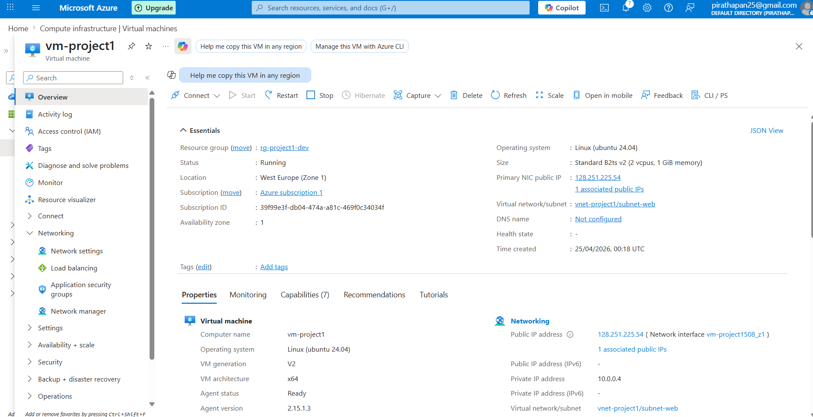
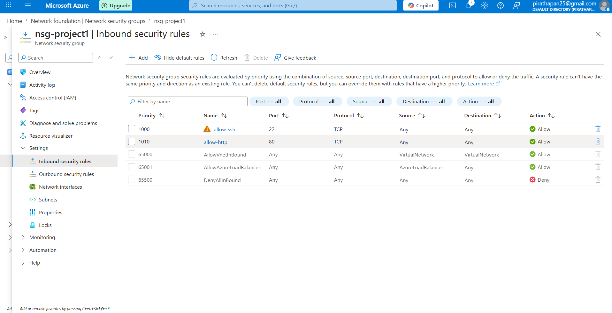
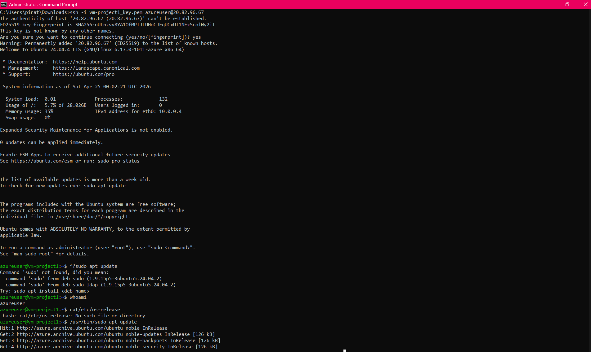
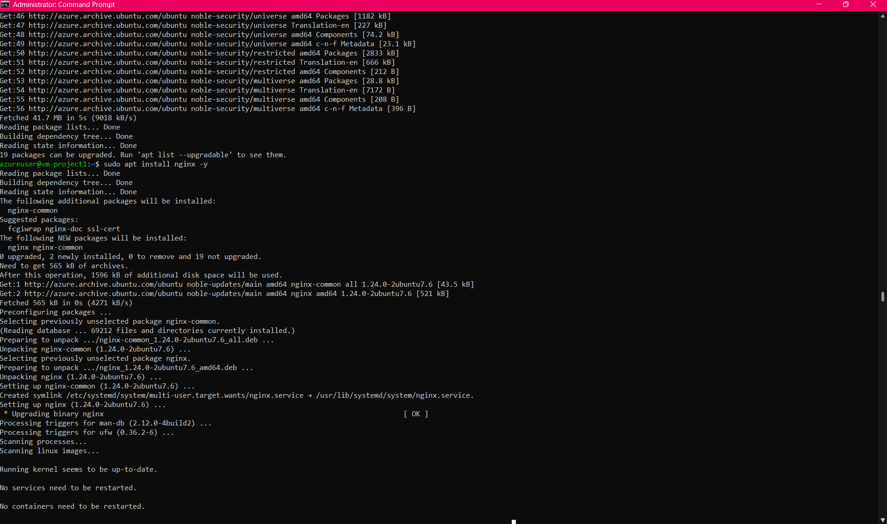
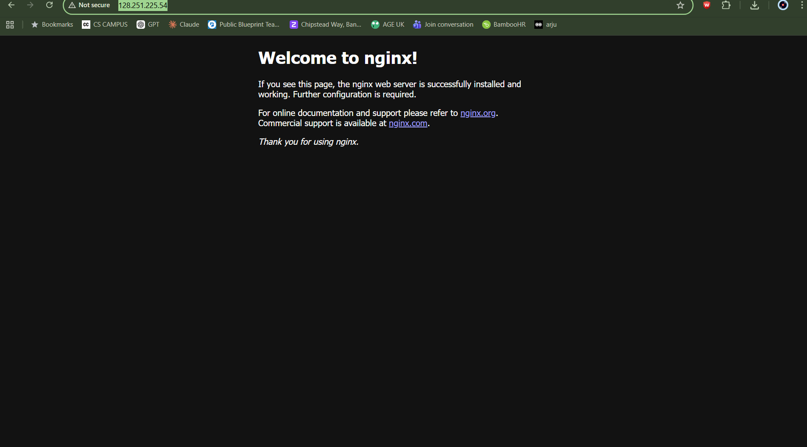

# ☁️ Azure Virtual Network + VM Deployment Project

## 📌 Project Overview

This project demonstrates the deployment of a complete cloud infrastructure in Microsoft Azure, including networking, virtual machine provisioning, security configuration, and web server hosting.

A Linux VM was deployed inside a custom Virtual Network and configured with a Network Security Group (NSG) to control inbound traffic. A web server (NGINX) was installed to host a publicly accessible website.

---

## 🏗️ Architecture
Internet
   ↓
Azure Public IP
   ↓
NSG (Firewall Rules: 22, 80) (NSG is associated with the VM’s network interface and controls inbound/outbound traffic rules.)
   ↓
NIC (Network Interface Card)
   ↓
Linux VM (Ubuntu 24.04)
   ↓
NGINX Web Server (Port 80)
   ↓
VNet + Subnet (Network Boundary)

---

## 🚀 Technologies Used

- Microsoft Azure (VMs, Networking, NSG)
- Ubuntu Server 24.04 LTS
- NGINX Web Server
- SSH (Key-based authentication)
- Virtual Networks (VNet)
- Network Security Groups (NSG)

---

## 🔧 Key Components Built

- Resource Group created for project isolation
- Virtual Network (VNet) with custom subnet
- Network Security Group (NSG) configured
  - SSH (Port 22)
  - HTTP (Port 80)
- Linux Virtual Machine deployed (Ubuntu 24.04 LTS)
- Public IP address assigned
- SSH key authentication configured
- NGINX installed and configured
- Web server successfully exposed to the internet

---

## 🖥️ Deployment Steps

1. Created Azure Resource Group
2. Configured Virtual Network and Subnet
3. Created and configured Network Security Group (NSG)
4. Deployed Ubuntu Virtual Machine
5. Enabled SSH access using key-based authentication
6. Installed NGINX web server
7. Configured HTTP access (port 80)
8. Verified public web access via browser

---

## 🌐 Live Deployment

The web server is accessible via public IP: 128.251.225.54 
Deployed on Azure VM accessible via public IP over HTTP (port 80)

---

## 📸 Screenshots

### VM Overview

### Network Security Group Rules

### SSH Connection

### Live Website

---

## 🧠 What I Learned

- Azure cloud infrastructure deployment
- Virtual networking (VNet, subnetting)
- Network security configuration (NSG rules)
- Linux server management
- SSH key authentication
- Web server deployment using NGINX
- Basic cloud architecture design

---

## 🔐 Security Concepts Demonstrated

- Network segmentation using VNets
- Firewall rules using NSGs
- Controlled inbound traffic (SSH + HTTP only)
- Key-based authentication instead of passwords

---

## 📈 Future Improvements

- Automate deployment using Terraform or Bicep
- Add CI/CD pipeline for web deployment
- Implement monitoring using Azure Monitor
- Introduce Load Balancer for scalability
- Add custom domain + HTTPS (SSL)

---

## 👨‍💻 Author

Built as part of a cloud engineering learning path focusing on Azure infrastructure, networking, and DevOps fundamentals.
